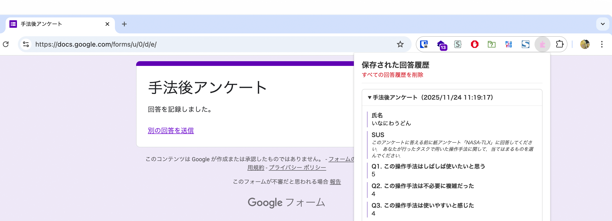

# Microsoft Form History

**Microsoftフォームの回答履歴を自動保存・表示するChrome拡張機能**



## 🌟 主な機能

### ✅ 基本機能
- **自動回答保存**: Microsoftフォームの回答をリアルタイムで自動保存
- **履歴表示**: 過去の回答履歴を見やすい形で表示
- **送信状態管理**: 下書き状態と送信済み状態を識別
- **フィルター機能**: 送信済み・下書き・すべての回答を選択表示

### 🤖 AI回答提案機能
- **自動回答提案**: 自由入力欄でAIが文章を提案
- **コンテキスト対応**: 質問内容に応じた適切な回答を生成
- **ワンクリック入力**: 提案された回答をクリックで簡単入力

### 📋 データ管理
- **ローカル保存**: 全データはブラウザ内にローカル保存
- **プライバシー保護**: 外部サーバーへの送信なし
- **データ削除**: 個別・一括削除機能

## 🚀 使い方

### インストール
1. [Releases](../../releases) から最新版をダウンロード
2. Chrome拡張機能管理画面（`chrome://extensions/`）を開く
3. デベロッパーモードを有効にする
4. zipファイルをドラッグ&ドロップして拡張機能を追加

### 基本的な使用方法

#### 1. Microsoftフォームにアクセス
以下のURLパターンのMicrosoftフォームで使用できます：
- `https://forms.office.com/pages/*` - Office 365フォーム
- `https://forms.office.com/r/*` - Office 365フォーム（短縮URL）
- `https://forms.microsoft.com/*` - 個人用Microsoftフォーム

#### 2. 自動回答保存機能
- **リアルタイム保存**: 入力内容は自動的にリアルタイム保存されます
- **下書き状態**: 未送信の回答は「下書き」として保存
- **送信状態**: フォーム送信後は「送信済み」として記録

#### 3. AI回答提案機能の使用
1. **提案ボタンの表示**
   - テキスト入力欄をクリックすると「AI回答提案」ボタンが表示されます
   
2. **回答提案の取得**
   - ボタンをクリックして質問内容に適した回答例を確認
   - 複数の提案から最適なものを選択可能
   
3. **提案の適用**
   - 気に入った提案をクリックして入力欄に自動入力
   - 手動での編集・調整も可能

#### 4. 回答履歴の確認
1. **履歴の表示**
   - 拡張機能アイコン（ツールバー）をクリック
   - 保存された回答履歴がポップアップで表示されます

2. **フィルター機能**
   - 「すべて」: 全ての保存された回答を表示
   - 「送信済み」: 送信完了した回答のみ表示
   - 「下書き」: 未送信の回答のみ表示

3. **履歴の操作**
   - 各履歴にフォームタイトルと回答日時が表示
   - 「削除」ボタンで個別削除可能
   - 「一括削除」で全履歴を削除可能

#### 5. 提出状態の判別機能
拡張機能は以下の方法で提出状態を自動判別します：
- **URL変化の監視**: 送信後のリダイレクト先URL検出
- **ページタイトル変更**: 「ありがとう」等の送信完了ページタイトル検出
- **DOM要素の監視**: 送信完了メッセージの表示検出

### 実際の使用例

#### アンケート回答時の活用
1. 同じような質問項目の多いアンケートで、過去の回答を参考にして一貫性を保つ
2. 長文回答が必要な場合、AI提案を活用して下書きを作成
3. 複数回に分けて回答する長期アンケートで、途中保存された内容を確認

#### 業務フォーム活用
1. 定期的な業務報告フォームで、前回の回答内容を参照
2. 評価・申請フォームで、類似項目の回答一貫性を確保
3. 研修・セミナー申込フォームで、過去の申込内容を再利用

### トラブルシューティング

#### 保存されない場合
- Microsoftフォームの対応URLかどうか確認
- 拡張機能が有効になっているかチェック
- ページをリロードしてから再度お試しください

#### AI提案が表示されない場合
- テキスト入力欄を一度クリックしてフォーカスを当てる
- ページを読み込み直してから再度お試しください

#### 履歴が表示されない場合
- Chrome拡張機能のポップアップをもう一度開く
- ブラウザのローカルストレージが無効になっていないか確認

## 🔧 技術仕様

### 対応ブラウザ
- Google Chrome 88+
- Microsoft Edge 88+
- その他Chromium系ブラウザ

### 対応フォームURL
- `https://forms.office.com/pages/*` - Office 365フォーム
- `https://forms.office.com/r/*` - Office 365フォーム（短縮URL）  
- `https://forms.microsoft.com/*` - 個人用Microsoftフォーム

### 保存可能な入力項目
| 項目タイプ | 対応状況 | 備考 |
|-----------|---------|------|
| ✅ テキスト入力（短文） | 完全対応 | AI提案機能対応 |
| ✅ 段落テキスト（長文） | 完全対応 | AI提案機能対応 |
| ✅ 単一選択（ラジオボタン） | 完全対応 | - |
| ✅ 複数選択（チェックボックス） | 完全対応 | - |
| ✅ ドロップダウン | 完全対応 | - |
| ✅ 日付入力 | 完全対応 | - |
| ✅ 時刻入力 | 完全対応 | - |
| ✅ 数値入力 | 完全対応 | - |
| ✅ メールアドレス | 完全対応 | - |
| ✅ 評価スケール | 完全対応 | - |
| ✅ 順位付け | 完全対応 | - |
| ✅ ファイルアップロード | 部分対応 | ファイル名のみ保存 |

### AI機能仕様
- **対応言語**: 日本語（プライマリ）、英語
- **提案タイプ**: 質問内容に応じた適切な回答例
- **応答時間**: 1-3秒（ネットワーク状況による）
- **プライバシー**: 質問文のみ使用、個人情報は送信なし

## 🛡️ プライバシーとセキュリティ

### データの取り扱い
- **ローカル保存**: すべての回答データはブラウザのローカルストレージに保存
- **外部送信なし**: データが外部サーバーに送信されることはありません
- **暗号化**: ローカルデータは標準的なブラウザ暗号化で保護

### 権限について
- `storage`: 回答データのローカル保存に使用
- `activeTab`: 現在のタブでのフォーム情報取得に使用

## 🔄 仕組みの詳細

### データ取得方法
1. **フォーム構造の取得**
   - `window.OfficeFormServerInfo`からフォーム情報を取得
   - DOMからフォーム要素を解析

2. **回答データの監視**
   - `MutationObserver`による入力要素の監視
   - リアルタイムでの回答データ抽出・保存

3. **送信状態の検出**
   - URLパターンの監視（thankyou等）
   - ページタイトルの変更検出
   - フォーム送信イベントの監視

### AI回答提案
- 質問文の内容解析
- コンテキストに応じた適切な回答生成
- 使いやすいUI/UXでの提案表示

## 📂 プロジェクト構成

```
src/
├── content/           # Microsoftフォームページで動作するスクリプト
│   ├── main.ts       # エントリーポイント
│   ├── form.ts       # フォーム構造の取得・保存
│   └── answer.ts     # 回答データの監視・保存・AI提案
├── popup/            # 拡張機能ポップアップUI
│   ├── App.tsx       # メインUI
│   ├── App.css       # スタイルシート
│   ├── main.tsx      # Reactエントリーポイント
│   └── index.html    # HTMLテンプレート
├── utils/            # 共通ユーティリティ
│   ├── types.ts      # TypeScript型定義
│   └── utils.ts      # 共通関数
└── web-accessible-resources.js  # フォーム情報取得用スクリプト
```

## 🛠️ 開発

### 開発環境のセットアップ
```bash
# 依存関係のインストール
npm install

# 開発サーバーの起動
npm run dev

# 本番ビルド
npm run build
```

### 使用技術
- **フレームワーク**: Vite + TypeScript
- **UI**: React + CSS
- **Chrome拡張機能**: Manifest V3
- **ビルドツール**: @crxjs/vite-plugin

### 貢献方法
1. このリポジトリをフォーク
2. 機能ブランチを作成 (`git checkout -b feature/AmazingFeature`)
3. 変更をコミット (`git commit -m 'Add some AmazingFeature'`)
4. ブランチにプッシュ (`git push origin feature/AmazingFeature`)
5. プルリクエストを作成

## 📄 ライセンス

このプロジェクトは[MIT License](LICENSE)の下で公開されています。

## 🙏 謝辞

このプロジェクトは[Google Form History](https://github.com/inaniwaudon/google-form-history)を参考にして、Microsoftフォーム対応として開発されました。

## ⚠️ 免責事項

この拡張機能は非公式のツールです。Microsoft Corporation との関係はありません。
- 本拡張機能の動作に関する正確性や完全性について、一切の保証をいたしかねます
- 使用は自己責任でお願いします
- 重要なデータは必ずバックアップを取ってください
